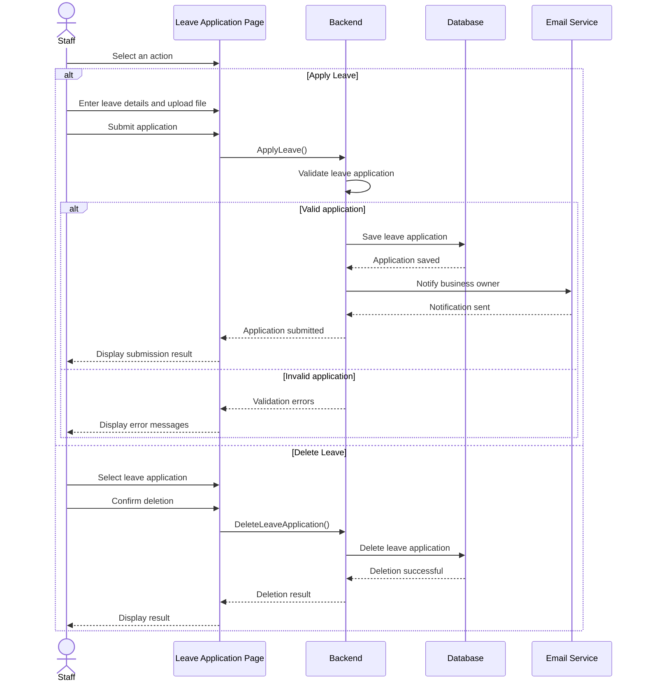

```mermaid
sequenceDiagram
    actor Staff
    participant UI as Leave Application Page
    participant Backend
    participant DB as Database
    participant Email as Email Service

    Staff->>UI: Select an action

    alt Apply Leave
        Staff->>UI: Enter leave details and upload file
        Staff->>UI: Submit application
        UI->>Backend: ApplyLeave()
        Backend->>Backend: Validate leave application

        alt Valid application
            Backend->>DB: Save leave application
            DB-->>Backend: Application saved
            Backend->>Email: Notify business owner
            Email-->>Backend: Notification sent
            Backend-->>UI: Application submitted
            UI-->>Staff: Display submission result

        else Invalid application
            Backend-->>UI: Validation errors
            UI-->>Staff: Display error messages
        end

    else Delete Leave
        Staff->>UI: Select leave application
        Staff->>UI: Confirm deletion
        UI->>Backend: DeleteLeaveApplication()
        Backend->>DB: Delete leave application
        DB-->>Backend: Deletion successful
        Backend-->>UI: Deletion result
        UI-->>Staff: Display result

    end
```