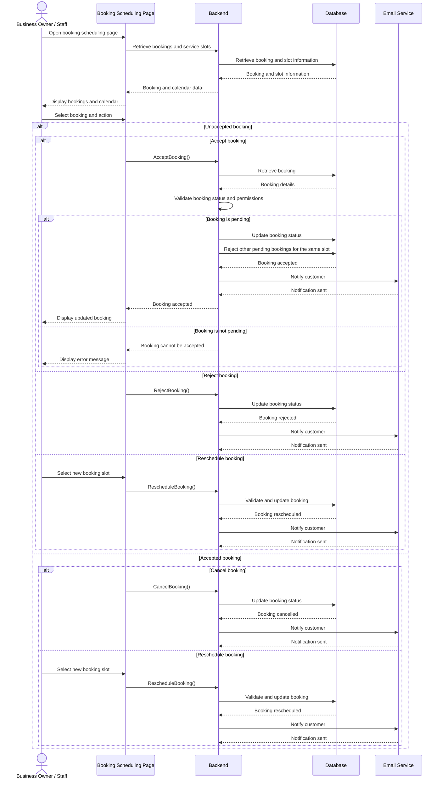

```mermaid
sequenceDiagram
    actor User as Business Owner / Staff
    participant UI as Booking Scheduling Page
    participant Backend
    participant DB as Database
    participant Email as Email Service

    User->>UI: Open booking scheduling page
    UI->>Backend: Retrieve bookings and service slots
    Backend->>DB: Retrieve booking and slot information
    DB-->>Backend: Booking and slot information
    Backend-->>UI: Booking and calendar data
    UI-->>User: Display bookings and calendar

    User->>UI: Select booking and action

    alt Unaccepted booking

       alt Accept booking
            UI->>Backend: AcceptBooking()
            Backend->>DB: Retrieve booking
            DB-->>Backend: Booking details
            Backend->>Backend: Validate booking status and permissions

            alt Booking is pending
                Backend->>DB: Update booking status
                Backend->>DB: Reject other pending bookings for the same slot
                DB-->>Backend: Booking accepted
                Backend->>Email: Notify customer
                Email-->>Backend: Notification sent
                Backend-->>UI: Booking accepted
                UI-->>User: Display updated booking
            else Booking is not pending
                Backend-->>UI: Booking cannot be accepted
                UI-->>User: Display error message
            end

        else Reject booking
            UI->>Backend: RejectBooking()
            Backend->>DB: Update booking status
            DB-->>Backend: Booking rejected
            Backend->>Email: Notify customer
            Email-->>Backend: Notification sent

        else Reschedule booking
            User->>UI: Select new booking slot
            UI->>Backend: RescheduleBooking()
            Backend->>DB: Validate and update booking
            DB-->>Backend: Booking rescheduled
            Backend->>Email: Notify customer
            Email-->>Backend: Notification sent
        end

    else Accepted booking

        alt Cancel booking
            UI->>Backend: CancelBooking()
            Backend->>DB: Update booking status
            DB-->>Backend: Booking cancelled
            Backend->>Email: Notify customer
            Email-->>Backend: Notification sent

        else Reschedule booking
            User->>UI: Select new booking slot
            UI->>Backend: RescheduleBooking()
            Backend->>DB: Validate and update booking
            DB-->>Backend: Booking rescheduled
            Backend->>Email: Notify customer
            Email-->>Backend: Notification sent
        end

    end
```