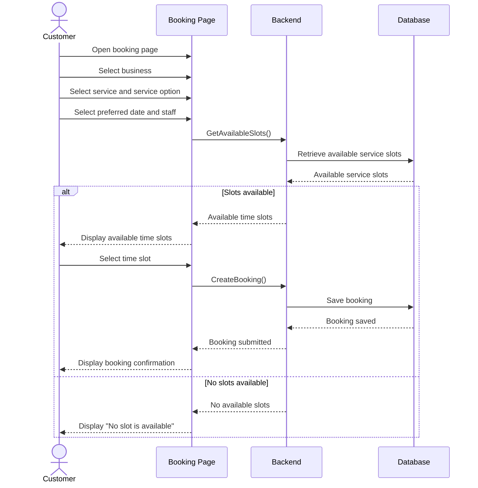

```mermaid
sequenceDiagram
    actor User as Customer
    participant UI as Booking Page
    participant Backend
    participant DB as Database

    User->>UI: Open booking page
    User->>UI: Select business
    User->>UI: Select service and service option
    User->>UI: Select preferred date and staff
    UI->>Backend: GetAvailableSlots()
    Backend->>DB: Retrieve available service slots
    DB-->>Backend: Available service slots

    alt Slots available
        Backend-->>UI: Available time slots
        UI-->>User: Display available time slots
        User->>UI: Select time slot
        UI->>Backend: CreateBooking()
        Backend->>DB: Save booking
        DB-->>Backend: Booking saved
        Backend-->>UI: Booking submitted
        UI-->>User: Display booking confirmation
    else No slots available
        Backend-->>UI: No available slots
        UI-->>User: Display "No slot is available"
    end
```
