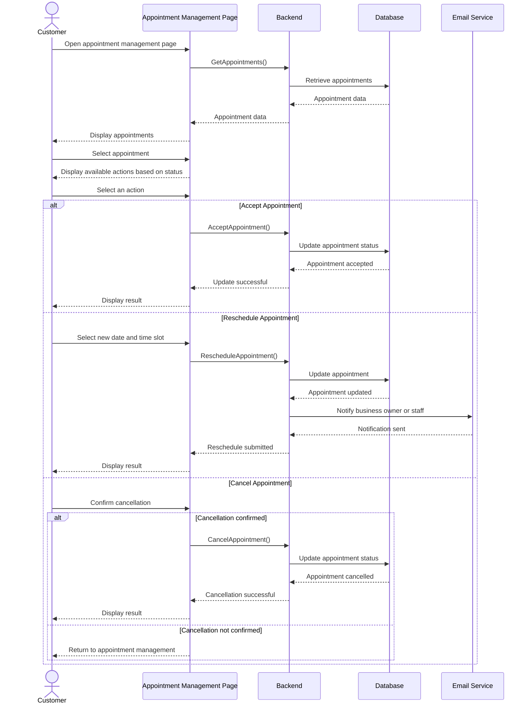

```mermaid
sequenceDiagram
    actor User as Customer
    participant UI as Appointment Management Page
    participant Backend
    participant DB as Database
    participant Email as Email Service

    User->>UI: Open appointment management page
    UI->>Backend: GetAppointments()
    Backend->>DB: Retrieve appointments
    DB-->>Backend: Appointment data
    Backend-->>UI: Appointment data
    UI-->>User: Display appointments

    User->>UI: Select appointment
    UI-->>User: Display available actions based on status
    User->>UI: Select an action

    alt Accept Appointment
        UI->>Backend: AcceptAppointment()
        Backend->>DB: Update appointment status
        DB-->>Backend: Appointment accepted
        Backend-->>UI: Update successful
        UI-->>User: Display result

    else Reschedule Appointment
        User->>UI: Select new date and time slot
        UI->>Backend: RescheduleAppointment()
        Backend->>DB: Update appointment
        DB-->>Backend: Appointment updated
        Backend->>Email: Notify business owner or staff
        Email-->>Backend: Notification sent
        Backend-->>UI: Reschedule submitted
        UI-->>User: Display result

    else Cancel Appointment
        User->>UI: Confirm cancellation

        alt Cancellation confirmed
            UI->>Backend: CancelAppointment()
            Backend->>DB: Update appointment status
            DB-->>Backend: Appointment cancelled
            Backend-->>UI: Cancellation successful
            UI-->>User: Display result
        else Cancellation not confirmed
            UI-->>User: Return to appointment management
        end
    end
```