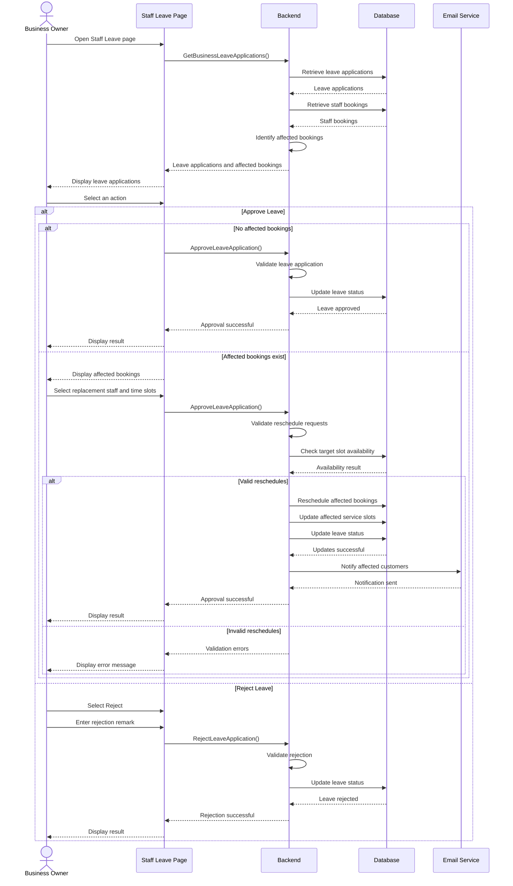

```mermaid
sequenceDiagram
    actor User as Business Owner
    participant UI as Staff Leave Page
    participant Backend
    participant DB as Database
    participant Email as Email Service

    User->>UI: Open Staff Leave page
    UI->>Backend: GetBusinessLeaveApplications()
    Backend->>DB: Retrieve leave applications
    DB-->>Backend: Leave applications

    Backend->>DB: Retrieve staff bookings
    DB-->>Backend: Staff bookings
    Backend->>Backend: Identify affected bookings
    Backend-->>UI: Leave applications and affected bookings
    UI-->>User: Display leave applications

    User->>UI: Select an action

    alt Approve Leave

        alt No affected bookings
            UI->>Backend: ApproveLeaveApplication()
            Backend->>Backend: Validate leave application
            Backend->>DB: Update leave status
            DB-->>Backend: Leave approved
            Backend-->>UI: Approval successful
            UI-->>User: Display result

        else Affected bookings exist
            UI-->>User: Display affected bookings
            User->>UI: Select replacement staff and time slots

            UI->>Backend: ApproveLeaveApplication()
            Backend->>Backend: Validate reschedule requests
            Backend->>DB: Check target slot availability
            DB-->>Backend: Availability result

            alt Valid reschedules
                Backend->>DB: Reschedule affected bookings
                Backend->>DB: Update affected service slots
                Backend->>DB: Update leave status
                DB-->>Backend: Updates successful

                Backend->>Email: Notify affected customers
                Email-->>Backend: Notification sent
                Backend-->>UI: Approval successful
                UI-->>User: Display result

            else Invalid reschedules
                Backend-->>UI: Validation errors
                UI-->>User: Display error message
            end
        end

    else Reject Leave
        User->>UI: Select Reject
        User->>UI: Enter rejection remark
        UI->>Backend: RejectLeaveApplication()
        Backend->>Backend: Validate rejection
        Backend->>DB: Update leave status
        DB-->>Backend: Leave rejected
        Backend-->>UI: Rejection successful
        UI-->>User: Display result
    end
```