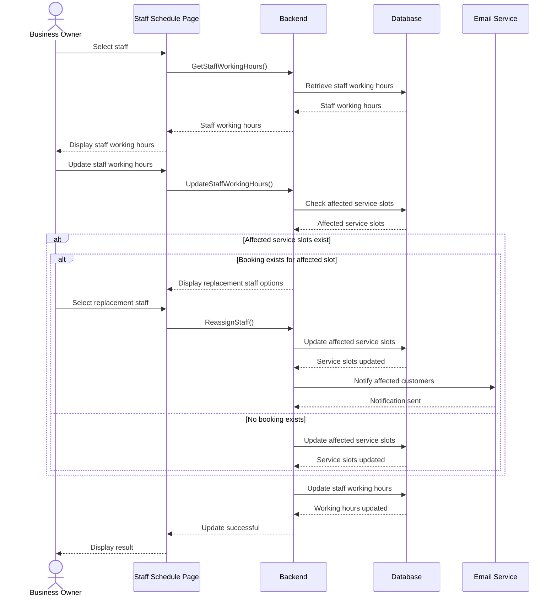

```mermaid
sequenceDiagram
    actor User as Business Owner
    participant UI as Staff Schedule Page
    participant Backend
    participant DB as Database
    participant Email as Email Service

    User->>UI: Select staff
    UI->>Backend: GetStaffWorkingHours()
    Backend->>DB: Retrieve staff working hours
    DB-->>Backend: Staff working hours
    Backend-->>UI: Staff working hours
    UI-->>User: Display staff working hours

    User->>UI: Update staff working hours
    UI->>Backend: UpdateStaffWorkingHours()

    Backend->>DB: Check affected service slots
    DB-->>Backend: Affected service slots

    alt Affected service slots exist

        alt Booking exists for affected slot
            Backend-->>UI: Display replacement staff options
            User->>UI: Select replacement staff
            UI->>Backend: ReassignStaff()
            Backend->>DB: Update affected service slots
            DB-->>Backend: Service slots updated
            Backend->>Email: Notify affected customers
            Email-->>Backend: Notification sent

        else No booking exists
            Backend->>DB: Update affected service slots
            DB-->>Backend: Service slots updated
        end

    end

    Backend->>DB: Update staff working hours
    DB-->>Backend: Working hours updated
    Backend-->>UI: Update successful
    UI-->>User: Display result
```